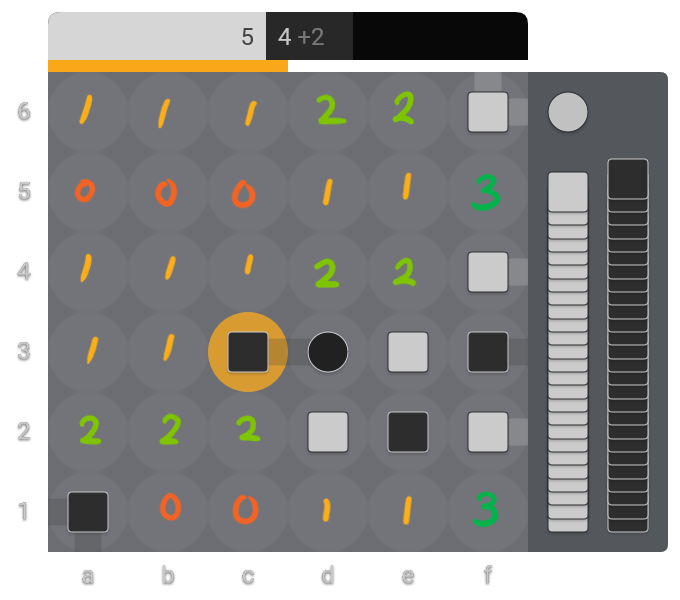

# Move Ordering

Now we are finally ready to start making our bot. We'll start with something that is perhaps a bit unconventional: [move ordering].

The usual way to introduce bot-making for board games (if one can even say there is a usual way)
is to start with some kind of tree-search such as minimax and then work through to [Negamax],
[Alpha-Beta pruning], and eventually add move ordering to improve performance.
In this tutorial we start with move ordering because I think it's a bit easier for someone
who has never heard of graphs and trees in the context of games.
As a bonus we'll get an IntuitionBot-style engine out of it which is easy to change.

The basic idea of move ordering is to rank moves from best to worst according to some [heuristic].
In the short term, our bot will just take the top move. After that we will add 1 move look-ahead
so that our bot doesn't blunder losses in 1. Sounds like a plan?

## Random Bot

Let's modify our code from the previous chapter to alternate between a player and a bot move.
We'll create two new functions `player_move` and `bot_move` that both receive a game state and
play a move. Then, we modify the the `cli` function to check whether it's the player's or bot's
turn to move. We'll keep the player color in a new variable called `player_color`.

```py
def player_move(game: Game):
    ...

def bot_move(game: Game):
    ...

def cli():
    player_color = Color.White
    game = new_game(6)

    while game.result == GameResult.Ongoing:
        pretty_print(game)
        if game.to_move == player_color:
            player_move(game)
        else:
            bot_move(game)

    pretty_print(game)
    match game.result:
        case GameResult.WhiteWin:
            print("🟧 wins!")
        case GameResult.BlackWin:
            print("🟦 wins!")
        case GameResult.Draw:
            print("It's a draw!")
```

We can continue by moving our code to get a move from the user into `player_move`, although we will want to adapt it.
We want to keep asking the user until they provide a valid move, and once they do, to stop looping.

```py
def player_move(game: Game):
    while True:
        user_input = input("enter move: ")
        try:
            move = Move.from_ptn(user_input)
        except ValueError as error:
            print(f"invalid PTN: {error}")
            continue
        try:
            game.play(move)
            break  # valid move was entered and played
        except ValueError as error:
            print(f"invalid move: {error}")
```

So that we can test whether we have completed this transformation without introducing any bugs,
let's just make `bot_move` play a random valid move.
We can get a list of valid moves using `game.possible_moves`, and then for picking a random
value out of a list we can use `random.choice` (once we import it).

```py
import random  # Put this at the top of the file.

def bot_move(game: Game):
    random_move = random.choice(game.possible_moves)
    game.play(random_move)
    print(f"the bot played {random_move}")
```

## A Little Cleanup

We will be adding a lot more to our bot, so to prepare for that, let's reorganize our code into modules.

Make two new files `bot.py` and `cli.py`. Move all of the current code into `cli.py`, except for the `bot_move`
function. Move `bot_move` into `bot.py`. To use `bot_move` from `cli.py` we need to import it like this:

```py
from bot import bot_move
```

> Make sure to add missing imports to `bot.py`, and remove any unnecessary ones in `cli.py` (such as `import random`).

Try running `python cli.py` now. You should be able to play against your random bot.

## Ranking Moves

There are multiple ways to implement move ordering.
For this tutorial we will give each move a score,
and the moves with the highest scores will be ranked first.

Let's add a new function `move_ordering` which takes a `Game` instance and returns a sorted list of `Move`s.
Then, in `bot_move`, we use that function to play the "best" move.

```py
def move_ordering(game: Game) -> list[Move]:
    moves = game.possible_moves
    return sorted(moves)

def bot_move(game: Game):
    moves = move_ordering(game)
    best_move = moves[0] 
    game.play(best_move)
    print(f"the bot played {best_move}")
```

If you try that code above you'll see an error like
`TypeError: '<' not supported between instances of 'builtins.Move' and 'builtins.Move'`.
That's because we are using `sorted` on a list of moves, but we haven't implemented
anything to compare the moves.

We can do this by defining another function that will score each move, and then we sort according to the scores.
Let's define this function *inside* `move_ordering`, so that we have easy access to variables we will pre-compute for all moves.

Then, we can use this new function as a key for `sorted`. We want higher scores to appear earlier in the list, so we should also tell
`sorted` to reverse the order (by default it sorts ascending, smallest to highest).

```py
def move_ordering(game: Game) -> list[Move]:
    def move_score(move: Move) -> float:
        ...

    moves = game.possible_moves
    return sorted(moves, key=move_score, reverse=True)
```

And now comes the fun part. What makes one move better than another?
Why is some move good in one situation, but then the same move is bad in another?
If you know the answers to those questions, you've just solved Tak!
I don't, so instead I will have to come up with some guesses based on my experience.

To make any sort of threat, one needs to make placements. Maybe we can start by valuing
placements above spreads. 

```py
# You need to import `MoveKind` as well.
from takpy import GameResult, Move, Piece, Color, Game, MoveKind

def move_ordering(game: Game) -> list[Move]:
    def move_score(move: Move) -> float:
        match move.kind:
            case MoveKind.Place:
                return 100
            case MoveKind.Spread:
                return 0

    moves = game.possible_moves
    return sorted(moves, key=move_score, reverse=True)
```

Now, all placements will get a score of `100`, while all spreads get a score of `0`.
This essentially means the bot will never spread, because any placement will have higher score.
The placement location and piece type will depend on what order the moves are generated in.

It's better than nothing, but we can do much better.

We'll need to combine multiple different heuristics, so let's keep a `score` which we will add to.
Let's also name our constants so that we don't end up with a bunch of [magic numbers].

```py
PLACEMENT = 100
SPREAD = 0

def move_ordering(game: Game) -> list[Move]:
    def move_score(move: Move) -> float:
        score = 0
        match move.kind:
            case MoveKind.Place:
                score += PLACEMENT
            case MoveKind.Spread:
                score += SPREAD
        return score

    moves = game.possible_moves
    return sorted(moves, key=move_score, reverse=True)
```

Let's prioritize placing flats over capstones, and capstones over walls:

```py
PLACEMENT = 100
SPREAD = 0
FLAT = 100
CAP = 50
WALL = 0

def move_ordering(game: Game) -> list[Move]:
    def move_score(move: Move) -> float:
        score = 0
        match move.kind:
            case MoveKind.Place:
                score += PLACEMENT
            case MoveKind.Spread:
                score += SPREAD
        match move.piece:
            case Piece.Flat:
                score += FLAT
            case Piece.Cap:
                score += CAP
            case Piece.Wall:
                score += WALL
        return score

    moves = game.possible_moves
    return sorted(moves, key=move_score, reverse=True)
```

> Note that `move.piece` will return `None` if the move was a spread.

We should also think about where it's good to place.
I think it is good to place road pieces where it contributes to a road effort.
Calculating which square benefits mosts roads is hard, but a decent heuristic is prioritizing squares
that are in the same row or column as existing road pieces.

A road piece is either a flat or capstone. We will check for this often,
so let's make it a function `road_piece`.

```py
def road_piece(piece: Piece) -> bool:
    return piece == Piece.Flat or piece == Piece.Cap
```

For the heuristic mentioned above, let's try counting how many
road pieces are in the same row or column as some given square.
For example, for the position below, I have looked at each empty square,
and counted how many road pieces are in the same row or column.



For this example, `f5` and `f1` would score highly, which is what we want since those placements build towards a road.

The row and column information doesn't change from between the different moves that
we are ranking, so we can just do it once in the outer function `move_ordering`.
To keep our code modular, let's split the implementation into multiple functions
that we can reuse for other heuristics.

```py
from collections.abc import Iterable

# Type aliases to make writing type hints easier
Stack = tuple[Piece, list[Color]]
Board = list[list[None | Stack]]

def count_road_pieces(stacks: Iterable[None | Stack], color: Color) -> int:
    only_stacks = (stack for stack in stacks if stack is not None)
    return sum(
        road_piece(piece) for piece, colors in only_stacks if colors[-1] == color
    )


def columns(board: Board) -> Board:
    return [[row[i] for row in board] for i in range(len(board[0]))]


def row_score(board: Board, color: Color) -> list[int]:
    return [count_road_pieces(row, color) for row in board]


def col_score(board: Board, color: Color) -> list[int]:
    return [count_road_pieces(col, color) for col in columns(board)]
```

> In case you are unfamiliar with the notation I used,
> take a look at [list comprehensions] and [generator expressions];
> they're great.

Now we can precalculate the row and column scores, and look them up when ranking placements.

```py
PLACEMENT = 100
SPREAD = 0
FLAT = 100
CAP = 50
WALL = 0
ROW_COLUMN_ROAD = 10


def move_ordering(game: Game) -> list[Move]:
    board = game.board
    my_row_score = row_score(board, game.to_move)
    my_col_score = col_score(board, game.to_move)

    def move_score(move: Move) -> float:
        score = 0
        row, column = move.square
        match move.kind:
            case MoveKind.Place:
                score += PLACEMENT
            case MoveKind.Spread:
                score += SPREAD
        match move.piece:
            case Piece.Flat:
                score += FLAT
            case Piece.Cap:
                score += CAP
            case Piece.Wall:
                score += WALL
        if road_piece(move.piece):
            score += ROW_COLUMN_ROAD * (my_row_score[row] + my_col_score[column])
        return score

    moves = game.possible_moves
    return sorted(moves, key=move_score, reverse=True)
```

With that implemented, the bot now tries to build for a road, although it doesn't take into account when it has been blocked.
Maybe we can encourage placing the capstone next to opponent stacks so that the bot has the opportunity to capture onto them
for a road in the future.

For this, we will need to find out the neighboring stacks to any given square. We have to be careful about not accessing positions
which do not exist on the board, but once that is taken care of, it's not difficult. We can make it a function for convenience.

```py
def neighbor_stacks(board: Board, size: int, row: int, col: int) -> list[Stack]:
    neighbors = []
    if row < size - 1:
        neighbors.append(board[row + 1][col])
    if row >= 1:
        neighbors.append(board[row - 1][col])
    if col < size - 1:
        neighbors.append(board[row][col + 1])
    if col >= 1:
        neighbors.append(board[row][col - 1])
    return [n for n in neighbors if n is not None]
```

Then we can look at the neighboring stacks when placing a capstone and add a bonus for each opponent stack,
multiplied by height to encourage attacking tall stacks.

```py
PLACEMENT = 100
SPREAD = 0
FLAT = 100
CAP = 50
WALL = 0
ROW_COLUMN_ROAD = 10
CAP_NEXT_TO_OPPONENT_STACK = 50


def move_ordering(game: Game) -> list[Move]:
    board = game.board
    my_color = game.to_move
    opp_color = game.to_move.next()
    my_row_score = row_score(board, my_color)
    my_col_score = col_score(board, my_color)

    def move_score(move: Move) -> float:
        score = 0
        row, column = move.square
        neighbors = neighbor_stacks(board, game.size, row, column)
        match move.kind:
            case MoveKind.Place:
                score += PLACEMENT
            case MoveKind.Spread:
                score += SPREAD
        match move.piece:
            case Piece.Flat:
                score += FLAT
            case Piece.Cap:
                score += CAP
                for _piece, colors in neighbors:
                    if colors[-1] == opp_color:
                        score += CAP_NEXT_TO_OPPONENT_STACK * len(colors)
            case Piece.Wall:
                score += WALL
        if road_piece(move.piece):
            score += ROW_COLUMN_ROAD * (my_row_score[row] + my_col_score[column])
        return score

    moves = game.possible_moves
    return sorted(moves, key=move_score, reverse=True)
```

Let's also add a bonus for placing near the center to help the bot pivot once it cannot make a threat in once direction.

For this we can calculate the distance from the center. We will use [Manhattan distance] because tak is played on grid
and road connections are orthogonal. It's easier to work with.

```py
def distance_from_center(row: int, col: int, size: int) -> float:
    mid = (size - 1) / 2
    return abs(row - mid) + abs(col - mid)
```

Then we use this function to get the distance, and subtract it from the score when placing.

```py
PLACEMENT = 100
SPREAD = 0
FLAT = 100
CAP = 50
WALL = 0
ROW_COLUMN_ROAD = 10
CAP_NEXT_TO_OPPONENT_STACK = 50
CENTER_PLACEMENT = 10


def move_ordering(game: Game) -> list[Move]:
    board = game.board
    my_color = game.to_move
    opp_color = game.to_move.next()
    my_row_score = row_score(board, my_color)
    my_col_score = col_score(board, my_color)

    def move_score(move: Move) -> float:
        score = 0
        row, column = move.square
        neighbors = neighbor_stacks(board, game.size, row, column)
        distance = distance_from_center(row, column, game.size)
        match move.kind:
            case MoveKind.Place:
                score += PLACEMENT
                score -= CENTER_PLACEMENT * distance
            case MoveKind.Spread:
                score += SPREAD
        match move.piece:
            case Piece.Flat:
                score += FLAT
            case Piece.Cap:
                score += CAP
                for _piece, colors in neighbors:
                    if colors[-1] == opp_color:
                        score += CAP_NEXT_TO_OPPONENT_STACK * len(colors)
            case Piece.Wall:
                score += WALL
        if road_piece(move.piece):
            score += ROW_COLUMN_ROAD * (my_row_score[row] + my_col_score[column])
        return score

    moves = game.possible_moves
    return sorted(moves, key=move_score, reverse=True)
```

If you try playing the bot now, you'll see something strange.
The bot does not consider that for the first two [plies], players play the opponents piece.
There are several ways to address this (you could even use a hardcoded opening), but maybe easiest
is just to reverse how we rank the moves for the first two plies. Since we are already reversing
at the end of `move_ordering`, we can just make it conditional and only reverse after the first
two plies have passed.

```py
def move_ordering(game: Game) -> list[Move]:
    ...
    return sorted(moves, key=move_score, reverse=game.ply > 1)
```

## One-move Lookahead

The bot plays... well, still very badly.
It's better than random, but it has a lot of room for improvement.
Let's move on from heuristics though, because we can also improve the bot in other ways.

I think the best thing we can do for our bot right now would be adding search.
I want to leave that for the next chapters, so instead I suggest we limit ourselves to a single move
lookahead. That means taking winning moves when we have them, and to prevent roads in 1 (when possible).

The idea is that for each of our moves that we get out of `move_ordering`
we will try playing it on a "virtual" board to see if it wins. If yes, we can just play it.
We can also check all of the opponent's moves from the position after our prospective move
to see if they can make a road. If yes, we should avoid playing that move.

Whether it's for us or for the opponent, we want to know if the current player can win.
Let's implement a function to check that and give us the winning move.

```py
def winning_move(game: Game, moves: list[Move]) -> Move | None:
    for move in moves:
        after_move = game.clone_and_play(move)
        if after_move.result.color() == game.to_move:
            return move
    return None
```

Notice that the order of the moves we pass in matters. If the move ordering gives us
likely winning moves early, then we do not have to simulate as many moves.
This idea of searching promising moves first will come up again when implementing
Alpha-Beta search in the next few chapters.

Now we can use that function in `bot_move` to take immediate wins.

```py
def bot_move(game: Game):
    moves = move_ordering(game)
    best_move = moves[0]

    possibly_winning = winning_move(game, moves)
    if possibly_winning is not None:
        # Take immediate wins.
        best_move = possibly_winning

    print(f"the bot played {best_move}")
    game.play(best_move)
```

Avoiding a road in 1 is a bit more complicated, but not too much.
The basic idea is that we try each move, and then if the game is not lost already,
we check if they have a winning move. If they don't we can play this move and
we break out of the loop.

```py
def bot_move(game: Game):
    moves = move_ordering(game)
    best_move = moves[0]

    possibly_winning = winning_move(game, moves)
    if possibly_winning is not None:
        # Take immediate wins.
        best_move = possibly_winning
    else:
        # Look for the first non-losing move.
        for my_move in moves:
            after_my_move = game.clone_and_play(my_move)
            if after_my_move.result.color() == after_my_move.to_move:
                continue  # I made a road for the opponent accidentally.
            if winning_move(after_my_move, move_ordering(after_my_move)) is None:
                best_move = my_move
                break

    print(f"the bot played {best_move}")
    game.play(best_move)
```

Try playing the bot now! It plays much better!

It can still fall into Tinue easily, but I'll leave that as an exercise for the reader.

Some things you can try implementing:
- Blocking enemy roads (maybe using `row_score` and `col_score`)
- Discourage flat-on-flat captures (Check whether the top piece of the spreading stack is a flat)
- Encourage placing walls near stacks with captives
- Avoid making negative flat-count-difference ([FCD]) moves (Compute the FCD of spreads)
- Reward strong shapes (citadels, staircases)

Some ideas to think about before the next chapter:
- When an opponent has a Tak threat, we need to prevent it.
That means that for every move we want to play, we have to check that same move,
and if is doesn't stop it, we can immediately reject our candidate move.
If we are able to identify these "killer" moves, checking for them first would improve performance.
Can you think of how we could implement that?
- The bot is currently searching 2 plies ahead. That means we consider our current move, and our opponents response.
How could you look 3 plies ahead? 4 plies? arbitrary `N` plies?
- Do we really have to look at all moves? Are there some moves which are so bad that we should not even consider them?
Could you figure out a way to identify such moves?
- You have some ideas about how to recognize good moves. What about good board positions? What makes one Tak position
better than another? Are there any ideas you can re-use from move ordering?

You can find the final code for this chapter here: <https://github.com/ViliamVadocz/takbot-tutorial/tree/main/part_2>

[move ordering]: https://www.chessprogramming.org/Move_Ordering
[negamax]: https://en.wikipedia.org/wiki/Negamax
[Alpha-Beta pruning]: https://en.wikipedia.org/wiki/Alpha%E2%80%93beta_pruning
[heuristic]: https://en.wikipedia.org/wiki/Heuristic_(computer_science)
[magic numbers]: https://en.wikipedia.org/wiki/Magic_number_(programming)
[list comprehensions]: https://docs.python.org/3.13/tutorial/datastructures.html#list-comprehensions
[generator expressions]: https://docs.python.org/3.13/tutorial/classes.html#generator-expressions
[Manhattan distance]: https://en.wikipedia.org/wiki/Taxicab_geometry
[plies]: https://en.wikipedia.org/wiki/Ply_(game_theory)
[FCD]: https://youtu.be/SHk5EBJpWOg
