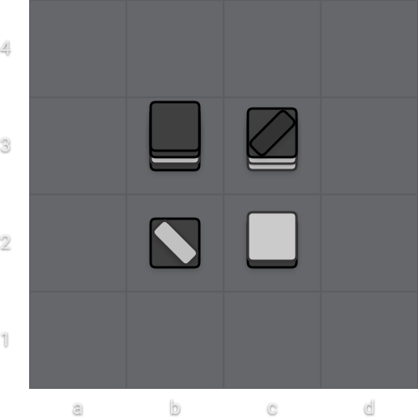

# Representing Tak

When implementing a bot for a board game, one would usually start by making an implementation of the game.
This is a fun challenge, but it is not a goal for this tutorial. For this reason, we will be using [`takpy`],
a library I prepared earlier, which includes a complete implementation of Tak. This means it has a state
representation and the move generation. It does not include a graphical user interface
(we will eventually be using [PlayTak] for that).

> `takpy` was actually not written in Python. It's a wrapper around my Rust library [`fast-tak`] which I wrote
> for my AlphaZero bots [WilemBot] and [TakZero]. If you have some feedback about the `takpy` interface, let me
> know on Discord or GitHub.

In this chapter I'll describe how we represent a position in the game, 
what sort of types there are, and how to use the library to play a game of Tak.

## Installation

Assuming you have a recent version of Python 3 installed, you can install `takpy` using `pip`:

```sh
pip install takpy
```

> Sometimes the Python executable and PIP are instead named `python3` and `pip3` respectively.
> You can try using those if my commands don't work for you.

Once that is done, start up your Python [REPL] and follow along with the examples:

```sh
> python
Python 3.12.5 (tags/v3.12.5:ff3bc82, Aug  6 2024, 20:45:27) [MSC v.1940 64 bit (AMD64)] on win32
Type "help", "copyright", "credits" or "license" for more information.
```

## Creating a New Game

To create a new game use `new_game`.

```py
>>> from takpy import new_game
>>> # Create a 5x5 game.
>>> new_game(5)
x5/x5/x5/x5/x5 1 1
>>> # Create a 6x6 game with 2 komi (4 half-komi).
>>> new_game(6, half_komi=4)
x6/x6/x6/x6/x6/x6 1 1
```

To make a game from [TPS] use `game_from_tps`.

```py
>>> from takpy import game_from_tps
>>> # Create a 4x4 game from TPS.
>>> game_from_tps(4, "12,1,1,1/2112,x3/1S,x3/2,x3 2 8")
12,1,1,1/2112,x3/1S,x3/2,x3 2 8
>>> # Create a 5x5 game from TPS with 2 komi.
>>> game_from_tps(5, "2,x4/x,1,x3/x2,1,x2/x3,2,x/x4,1 2 3", half_komi=4)
2,x4/x,1,x3/x2,1,x2/x3,2,x/x4,1 2 3
```

> Using half-komi is admittedly a little confusing,
> but it allows for fractional komi without needing to use floating point numbers.
> A komi of `2.5` would be represented by `5` half-komi.

## The Board and Stacks

Each square on an NxN Tak board can contain a very high stack, only limited by the number of reserves available.
We represent the board as a nested list: The outer lits contains rows, and the rows are lists of squares.
A square is either empty (represented by `None`), or it contains a stack. A stack is a top `Piece` and
a list of colors for every piece in the stack from bottom to top.

An empty 5x5 board would look like this:

```py
>>> game = new_game(5)
>>> game
x5/x5/x5/x5/x5 1 1
>>> game.board()
[
    [None, None, None, None, None],
    [None, None, None, None, None],
    [None, None, None, None, None],
    [None, None, None, None, None],
    [None, None, None, None, None]
]
```

> If you are following along (as you should be!) then the board representation is likely not nicely
> aligned like in the above example. I formatted it nicely here for clarity.

If we play `a1`, we get this board:

```py
>>> from takpy import Move
>>> game.play(Move("a1"))   
>>> game
x5/x5/x5/x5/2,x4 2 1
>>> game.board()
[
    [(Piece.Flat, [Color.Black]), None, None, None, None],
    [                       None, None, None, None, None],
    [                       None, None, None, None, None],
    [                       None, None, None, None, None],
    [                       None, None, None, None, None]
]
```

You can see from this example that `a1` is the first element in the first row.
Likewise, `a2` is the first element in the second row:

```py
>>> game.play(Move("a2")) 
>>> game      
x5/x5/x5/1,x4/2,x4 1 2
>>> game.board()
[
    [(Piece.Flat, [Color.Black]), None, None, None, None],
    [(Piece.Flat, [Color.White]), None, None, None, None],
    [                       None, None, None, None, None],
    [                       None, None, None, None, None],
    [                       None, None, None, None, None]
]
```

---

Let's take a closer look at how the squares are represented.
We will use the position shown in the image below.



```py
>>> game = game_from_tps(4, "x4/x,2122,1122S,x/x,21S,21,x/x4 2 12")
>>> game
x4/x,2122,1122S,x/x,21S,21,x/x4 2 12
>>> game.board()
[
    [None,                                                               None,                                                               None, None],
    [None,                           (Piece.Wall, [Color.Black, Color.White]),                           (Piece.Flat, [Color.Black, Color.White]), None],
    [None, (Piece.Flat, [Color.Black, Color.White, Color.Black, Color.Black]), (Piece.Wall, [Color.White, Color.White, Color.Black, Color.Black]), None],
    [None,                                                               None,                                                               None, None]
]
```

Probably the first thing you notice is that the rows are in the opposite order:
The stacks which appear in the second row from the top in the image actually appear in the third row in the board representation.
This is because in the image the ranks increase as we go further up, but in the representation, we want the ranks to increase as
we go further in the, which is displayed further down.

At `b2` we have a white wall on top of a black flat. This is represented by `(Piece.Wall, [Color.Black, Color.White])`
in the second element of the second row of the board. Notice that the colors in the stack are stored bottom to top.

```py
>>> board = game.board()
>>> board[1][1]  # b2
(Piece.Wall, [Color.Black, Color.White])
```

> The second element in the second row is at `[1][1]` because we start indices from `0`.

Since the colors are stored bottom to top, to get the color of the top of the stack,
you would access the color at `[-1]` (i.e. the last element).

```py
>>> piece, colors = board[1][1]
>>> colors[-1]  # getting the color at the top of the stack
Color.White
```

Here are all the other stacks:

```py
>>> board[1][2]  # c2
(Piece.Flat, [Color.Black, Color.White])
>>> board[2][1]  # b3
(Piece.Flat, [Color.Black, Color.White, Color.Black, Color.Black])
>>> board[2][2]  # c3
(Piece.Wall, [Color.White, Color.White, Color.Black, Color.Black])
```

## Making Moves

To make a move in the game, you first need to know which moves are possible.
You can use `.possible_moves` to get a list of moves that are possible in the current position.

```py
>>> game = new_game(6)
>>> game.possible_moves()
[
    a1, a2, a3, a4, a5, a6,
    b1, b2, b3, b4, b5, b6,
    c1, c2, c3, c4, c5, c6,
    d1, d2, d3, d4, d5, d6,
    e1, e2, e3, e4, e5, e6,
    f1, f2, f3, f4, f5, f6
]
```

To make a move, use `.play(move)` with a valid move.

```py
>>> my_move = game.possible_moves()[3]
>>> my_move
a4
>>> game.play(my_move)
>>> game
x6/x6/2,x5/x6/x6/x6 2 1
>>> game.board()
[
    [                       None, None, None, None, None, None],
    [                       None, None, None, None, None, None],
    [                       None, None, None, None, None, None],
    [(Piece.Flat, [Color.Black]), None, None, None, None, None],
    [                       None, None, None, None, None, None],
    [                       None, None, None, None, None, None]
]
```

If you try playing an invalid move, you will get a `ValueError`.

```py
>>> game.play(my_move)  # try to play `a4` again
Traceback (most recent call last):
  File "<stdin>", line 1, in <module>
ValueError: cannot place a piece in that position because it is already occupied
```

As we have seen earlier, we can also create moves using their [PTN] representation:

```py
>>> another_move = Move("a6")
>>> another_move
a6
>>> game.play(another_move)
>>> game
1,x5/x6/2,x5/x6/x6/x6 1 2
>>> game.board()
[
    [                       None, None, None, None, None, None],
    [                       None, None, None, None, None, None],
    [                       None, None, None, None, None, None],
    [(Piece.Flat, [Color.Black]), None, None, None, None, None],
    [                       None, None, None, None, None, None],
    [(Piece.Flat, [Color.White]), None, None, None, None, None]
]
```

## Other Useful Features

It's often useful to create a copy of the current position so something can be simulated on the copy without affecting the original.
You can use `.clone()` for this:

```py
>>> clone = game.clone()
>>> clone  # it's the same as `game`
1,x5/x6/2,x5/x6/x6/x6 1 2
>>> clone.play(Move("Cb2"))  # play another move
>>> clone
1,x5/x6/2,x5/x6/x,1C,x4/x6 2 2
>>> clone.board()
[
    [                       None,                       None, None, None, None, None],
    [                       None, (Piece.Cap, [Color.White]), None, None, None, None],
    [                       None,                       None, None, None, None, None],
    [(Piece.Flat, [Color.Black]),                       None, None, None, None, None],
    [                       None,                       None, None, None, None, None],
    [(Piece.Flat, [Color.White]),                       None, None, None, None, None]
]
>>> game  # unaffected
1,x5/x6/2,x5/x6/x6/x6 1 2
>>> game.board()
[
    [                       None, None, None, None, None, None],
    [                       None, None, None, None, None, None],
    [                       None, None, None, None, None, None],
    [(Piece.Flat, [Color.Black]), None, None, None, None, None],
    [                       None, None, None, None, None, None],
    [(Piece.Flat, [Color.White]), None, None, None, None, None]
]
```

This pattern of creating a clone and playing a move is very common.
To make it easier, there exists a convenience method `.clone_and_play()`:

```py
>>> game
1,x5/x6/2,x5/x6/x6/x6 1 2
>>> clone = game.clone_and_play(Move("Sd3"))
>>> clone # the clone has `Sd3` on the board
1,x5/x6/2,x5/x3,1S,x2/x6/x6 2 2
>>> game  # unaffected
1,x5/x6/2,x5/x6/x6/x6 1 2
```

The `Game` object provides various other information and helper methods:
- the size of the board (`.size`)
- the half-komi (`.half_komi`)
- whose turn it is (`.to_move`)
- reserve counts (`.white_reserves`, `.black_reserves`)
- how many [plies] have been played (`.ply`)
- the result of the game (`.result()`)
- and more!

```py
>>> game.size
6
>>> game.half_komi
0
>>> game.to_move
Color.White
>>> game.white_reserves
(29, 1)
>>> game.black_reserves
(29, 1)
>>> game.ply
2
>>> game.result()
GameResult.Ongoing
```

The entire available interface can be seen in the [`takpy.pyi`] [stub file]
unless I forget to update it when I change the underlying code.
Please let me know if you encounter any inconsistencies!

[`fast_tak`]: https://github.com/ViliamVadocz/fast-tak
[`takpy.pyi`]: https://github.com/ViliamVadocz/takpy/blob/main/takpy.pyi
[`takpy`]: https://pypi.org/project/takpy/
[PlayTak]: https://playtak.com/]
[plies]: https://en.wikipedia.org/wiki/Ply_(game_theory)
[PTN]: https://ustak.org/portable-tak-notation/
[REPL]: https://en.wikipedia.org/wiki/Read%E2%80%93eval%E2%80%93print_loop
[stub file]: https://typing.readthedocs.io/en/latest/spec/distributing.html#stub-files
[TakZero]: https://github.com/ViliamVadocz/takzero
[TPS]: https://ustak.org/tak-positional-system-tps/
[WilemBot]: https://github.com/ViliamVadocz/tak
